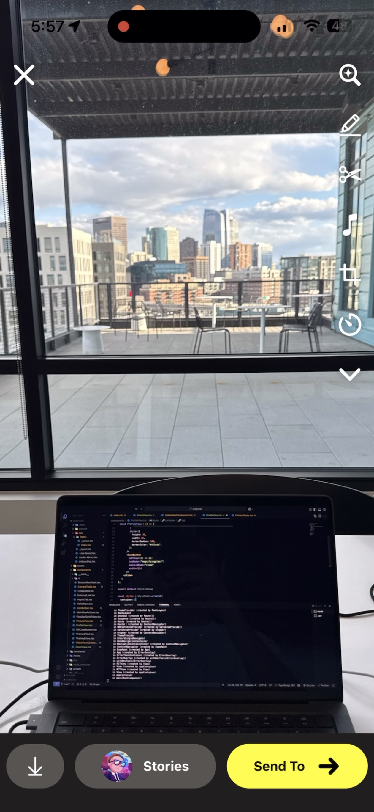

# 📸 Snapchat Camera Clone — Built with Expo

This is a basic **Snapchat-style camera app** built with [Expo](https://expo.dev), featuring:

- 📷 **Camera functionality** using `expo-camera`
- 🎥 **Video recording** and playback
- 🖼️ **Image and video previews** using `expo-image` and `expo-video`
- 📤 **Sharing media** via `expo-sharing`
- 💾 **Saving to device** with `expo-media-library`
- 🔍 **QR Code scanning** included and fully functional

---

## 🚀 Features

- Open the camera and take a **photo** or record a **video**
- **Preview** media right after capture
- Choose to **save** it to your device or **share** it with someone
- **Scan QR codes** directly from the camera view
- Built using modern Expo tools and hooks

---

## 🧰 Tech Stack

- [`expo-camera`](https://docs.expo.dev/versions/latest/sdk/camera/) – access to device camera
- [`expo-video`](https://docs.expo.dev/versions/latest/sdk/video/) – video playback
- [`expo-media-library`](https://docs.expo.dev/versions/latest/sdk/media-library/) – saving media to gallery
- [`expo-sharing`](https://docs.expo.dev/versions/latest/sdk/sharing/) – system-native share functionality
- [`expo-image`](https://docs.expo.dev/versions/latest/sdk/image/) – fast, responsive image display
- [`expo-router`](https://expo.dev/router) – for navigation and routing
- Fully built with **Expo** for cross-platform support

---

<div align="center">
  
  
</div>

---

## 📦 Installation

```bash
npm install
npx expo start
```

Scan the QR code with the **Expo Go** app or run it in an emulator.

---

## 📚 Learn More

- [Expo Camera Docs](https://docs.expo.dev/versions/latest/sdk/camera/)
- [Expo Media Library](https://docs.expo.dev/versions/latest/sdk/media-library/)
- [Expo Sharing](https://docs.expo.dev/versions/latest/sdk/sharing/)
- [Expo Video](https://docs.expo.dev/versions/latest/sdk/video/)
- [Expo QR Scanning Guide](https://docs.expo.dev/versions/latest/sdk/bar-code-scanner/)
